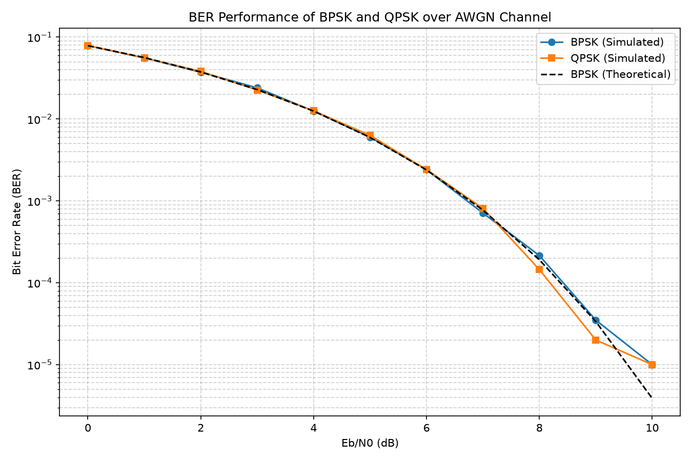

# Digital Communication System Simulator (BPSK/QPSK over AWGN)

A Python-based simulation of digital modulation schemes (**BPSK** and **QPSK**)
transmitted over an **AWGN (Additive White Gaussian Noise) channel**, with
**Bit Error Rate (BER) vs Eb/N0** analysis — the standard performance metric
used to evaluate real-world digital communication systems.

## What this project does

1. Generates random binary data (the "message" to transmit).
2. Modulates the bits into BPSK and QPSK symbols.
3. Passes the symbols through a simulated noisy (AWGN) channel.
4. Demodulates the received (noisy) symbols back into bits.
5. Compares transmitted vs received bits to compute the Bit Error Rate.
6. Repeats this across a range of signal-to-noise ratios (Eb/N0, 0–10 dB).
7. Plots simulated BER curves against the theoretical BPSK BER curve.

## Project structure

digital-comm-simulator/
├── modulation.py     # BPSK/QPSK modulation & demodulation functions
├── channel.py         # AWGN channel simulation
├── simulate.py         # Main script: runs experiment, plots BER curve
├── requirements.txt    # Python dependencies
└── README.md

## Setup instructions (step by step)

### 1. Install Python
Make sure Python 3.8+ is installed. Check with:
python3 --version

If not installed, download from https://www.python.org/downloads/

### 2. Install dependencies
From inside the project folder:
pip install -r requirements.txt

### 3. Run the simulation
python simulate.py

This will:
- print BER values for each Eb/N0 level in the terminal
- save a plot as ber_vs_snr.png
- display the plot in a window

## Understanding the output

- X-axis (Eb/N0 in dB): signal quality — higher = less noisy channel
- Y-axis (BER, log scale): fraction of bits received incorrectly
- As Eb/N0 increases, BER should drop sharply (fewer errors) — this is
  the expected "waterfall curve" seen in all real communication systems.
- The simulated BPSK curve closely matches the black dashed theoretical
  curve, validating the simulation's correctness.

## Possible extensions

- 8-PSK or 16-QAM modulation schemes for comparison
- Channel coding (e.g., Hamming code or convolutional coding) to show
  error correction improving BER
- Rayleigh fading channel instead of just AWGN (models real wireless
  multipath environments)
- OFDM simulation (used in 4G/5G/WiFi) as a bigger extension

## Tech stack
- Python 3
- NumPy (signal generation & math)
- Matplotlib (plotting results)
- SciPy (theoretical error function calculations)
